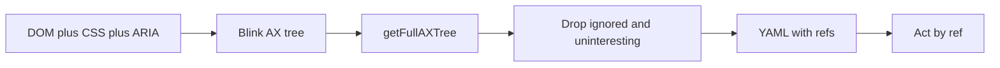

# AXTree Accessibility Tree

**AXTree** (accessibility tree) is the semantic tree a browser builds from the DOM, CSS, and ARIA so assistive technology can query each control's role, name, and state. An agent that drives the page should read a pruned snapshot of that tree and act by reference. The raw Blink tree is the wrong payload for a prompt.

## Three trees

Blink
: Chromium's renderer builds an internal accessibility tree and exposes it through the Chrome DevTools Protocol, `Accessibility.getFullAXTree`. The tree still contains ignored nodes, unnamed `generic` wrappers, and text nodes that sit under buttons. DevTools reads this tree.

Platform
: Chromium maps that internal tree onto the platform API (NSAccessibility, UI Automation, ATK/AT-SPI). Screen readers see the mapped tree. Most internal nodes are dropped on the way, and attribute names differ by platform. DevTools shows the internal tree, whose roles follow ARIA.

Snapshot
: Puppeteer, Playwright, and browser agents serialize a third view for a program or a model. Puppeteer calls the default view the interesting subset. Playwright MCP prints it as YAML with a `ref` on each exposed node.

A cross-origin iframe lives in another renderer process and has its own tree. A client that wants one picture fetches each frame and stitches the subtrees. Puppeteer's `includeIframes` option defaults to false.

## What a node carries

A CDP `AXNode` has `nodeId`, `ignored`, `role`, `name`, `description`, `value`, `properties` (`checked`, `expanded`, `disabled`, `focused`, `level`, and the rest), `childIds`, and `backendDOMNodeId` back to the DOM node.

The accessible name follows AccName, in this order:

1. `aria-labelledby`
2. `aria-label`
3. The host-language label: a `<label>`, `alt`, or the text content where the role allows a name from contents
4. `title`, as a last resort

A placeholder is not a specified name source. A control whose only hint is `placeholder` has no reliable name.

`getFullAXTree` takes an optional `depth` and `frameId`. `getPartialAXTree` returns one subtree. `queryAXTree` finds nodes by computed role and accessible name and includes nodes that are ignored for accessibility, so a lookup can still find an off-screen target after the prompt view has been pruned.

## What the raw tree looks like

Blink does not emit the tidy tree an agent wants. Chrome's own example of a label, a number input, and two buttons includes ignored `genericContainer` nodes and a `staticText` child under each button whose name repeats the button's name. DevTools hides ignored nodes and unnamed `generic` nodes, and it promotes their children so the visible tree stays connected. The full tree, ignored nodes included, stays available so updates still match the backend.

That hidden layer is what blows a prompt up. A `
` used only for layout survives as a generic node until something prunes it.

## Optimize the UI

The browser can only name and collapse what the markup supports. Build the page so the tree Blink emits is already close to the snapshot.

- Use the HTML element that already has the right implicit role: `button`, `a`, `nav`, `main`, `input`, `label`, headings, lists. Add ARIA when native HTML cannot express the widget.
- Give every interactive control one accessible name, and make that name the visible text. Use `aria-label` when there is no visible name, such as an icon button. `aria-label` replaces the contents.
- Keep landmarks (`banner`, `navigation`, `main`, `search`, `contentinfo`, `form`, `region`) and heading levels. A snapshot can be scoped to one of them without a CSS selector.
- Reflect state on the node: `aria-expanded`, `aria-checked`, `aria-pressed`, `aria-disabled`, `aria-invalid`, `aria-current`. A class that only changes color does not show up as state.
- Let `display: none`, `visibility: hidden`, the `hidden` attribute, and `aria-hidden="true"` remove nodes that are actually gone. Leave the control the user has to activate in the tree.
- Keep `role="presentation"` and `role="none"` off interactive elements. The role is the label the snapshot prints.
- A click handler on a `
` stays a generic node unless that element is also a button, with a role, a name, and keyboard support.
- Canvas and WebGL do not grow a useful tree. Expose the same actions as DOM controls, or the agent has to fall back to pixels.
- Shadow DOM is part of the tree the renderer builds. A cross-origin iframe is a separate document and a separate fetch.

## Optimize the snapshot

Run `Accessibility.getFullAXTree`, then reduce the result. The protocol payload is not the prompt.

1. **Fetch a subtree.** Pass `frameId` for the frame in use. Pass `depth`, or a root node, when the task is one region (`main`, a dialog, a form). `queryAXTree` answers "is there a button named Pay?" without walking the page into the prompt.
2. **Drop ignored nodes and unnamed generic nodes.** Promote their children, the way DevTools does, so a removed wrapper does not split the tree.
3. **Keep interesting nodes.** Puppeteer's default `interestingOnly: true` is a concrete rule set. A node is dropped when its role is `Ignored`, it is hidden, or CDP marked it ignored. A node is kept when it is a landmark, focusable, richly editable, busy, a live region other than `off`, modal, or it carries `errormessage`, `details`, or `roledescription`. Control roles are kept even when they are not focusable: `button`, `checkbox`, `ColorWell`, `combobox`, `DisclosureTriangle`, `listbox`, `menu`, `menubar`, `menuitem`, `menuitemcheckbox`, `menuitemradio`, `radio`, `scrollbar`, `searchbox`, `slider`, `spinbutton`, `switch`, `tab`, `textbox`, `tree`, and `treeitem`. `link` is not in that control-role list. An ordinary link is kept because it is focusable. Inside a control, a non-focusable child is dropped: the `staticText` under a button repeats the button's name. Text fields and headings that already have a name are leaves, so their inner text is not serialized again. When an uninteresting node is removed, its interesting children are promoted.
4. **Serialize compact YAML.** Playwright's aria snapshot line is `- role "name" [state]`. Playwright MCP adds `[ref=e5]`. States worth keeping on the line are `checked`, `disabled`, `expanded`, `invalid`, `level`, `pressed`, and `selected`. A link can carry `/url`. Act with the ref: `browser_click { target: "e10" }`. A ref is unique inside one snapshot, is assigned to every node the snapshot exposes, and dies when the page changes. A stale ref fails with `Ref <ref> not found in the current page snapshot`. A Playwright selector is the escape hatch when the element is already known.
5. **Scope what the model reads.** `browser_snapshot` accepts `target` (one subtree), `depth`, and `filename` (write the tree to a file and return the path). `browser_find` returns the matching nodes plus a few lines of context under their path from the root. `--snapshot-mode=none` stops tools from attaching a fresh snapshot after every action. Turn boxes on only when a coordinate is required. `[box=x,y,width,height]` is viewport-relative CSS pixels.
6. **Replace the subtree that changed.** Resending the same header, nav, and footer on every step spends the context window on nodes the task already saw. Keep the landmark summary and send the subtree that changed. That is an agent policy on top of the snapshot, not a browser feature.
7. **Fuse layout when the AX tree misses the target.** browser-use does not stop at the AX tree. `DOMTreeSerializer.serialize_accessible_elements` builds a simplified tree from tags, ARIA roles, AX properties, and JS click listeners, removes nodes covered by paint order, drops unnecessary parents, applies a bounding-box filter, then assigns indexes to the interactive nodes. Use that path when the click target is a styled `div` with a listener and no role. It costs a DOM snapshot and a layout snapshot on top of `getFullAXTree`.
8. **Add a screenshot when the target has no node.** Playwright MCP's default observation is the snapshot. A screenshot covers canvas, charts, and icon-only layouts. Pair it with the snapshot when the model still needs a ref to act.

Off-screen content remains in `getFullAXTree`. Collapsing off-screen subtrees to a landmark name, while leaving `queryAXTree` unfiltered so the agent can scroll to them, is a proposed CEF setting (`ax_viewport_collapse`, opened 2026-03-20). It is not Chrome's default.

## Keep or drop

| Keep                                                                  | Drop                                                                      |
| --------------------------------------------------------------------- | ------------------------------------------------------------------------- |
| Landmarks, headings, lists                                            | Ignored nodes                                                             |
| Focusable controls, control roles, and their name                     | Unnamed `generic` / `genericContainer` wrappers, after promoting children |
| State: checked, expanded, disabled, pressed, invalid, selected, level | `staticText` and `InlineTextBox` already copied into the parent's name    |
| Live regions that are not `off`, busy, modal, error message           | Nodes removed by `display: none`, `visibility: hidden`, or `aria-hidden`  |
| The open dialog's subtree, when a tool reports a dialog               | Class names, inline style, and the raw HTML                               |
| A ref, or `backendDOMNodeId`                                          | A second copy of a name that already sits on the parent                   |

The page behind a modal is still in the full tree. Scope the snapshot to the dialog instead of assuming the browser deleted the background.

## Check the tree

In Chrome DevTools, the Accessibility pane and the full accessibility tree view show the internal tree. The default view hides ignored nodes and unnamed generic nodes.

In Playwright, `page.ariaSnapshot()` and `locator.ariaSnapshot()` print the YAML. `toMatchAriaSnapshot` compares a template to that tree. Scope the template to `main` or a dialog. A template of the whole page breaks on every copy change.

A control is in good shape when the snapshot shows the right role, the visible name, and the current state, and when a layout `
` does not appear as its own node.

## References

- Chrome DevTools, full accessibility tree (2021-12-13): https://developer.chrome.com/blog/full-accessibility-tree
- Chrome DevTools Protocol, Accessibility domain: https://chromedevtools.github.io/devtools-protocol/tot/Accessibility
- W3C Accessible Name and Description Computation 1.2: https://www.w3.org/TR/accname-1.2/
- Puppeteer `Accessibility.ts` (`interestingOnly`, `isInteresting`): https://github.com/puppeteer/puppeteer/blob/main/packages/puppeteer-core/src/cdp/Accessibility.ts
- Playwright aria snapshots: https://playwright.dev/docs/aria-snapshots
- Playwright MCP snapshots: https://playwright.dev/mcp/snapshots
- browser-use `serialize_accessible_elements`: https://github.com/browser-use/browser-use/blob/main/browser_use/dom/serializer/serializer.py
- CEF proposal, viewport collapse for CDP AX trees (issue 4133, 2026-03-20): https://github.com/chromiumembedded/cef/issues/4133

> **See also:** [Coding Agents](/Technology/AI/Tools/Agents/Coding Agents) · [AI Coding Productivity Tools](/Technology/AI/Tools/Agents/AI Coding Productivity Tools) · [Google AX](/Technology/AI/Tools/Agents/Google%20AX.md) (cluster orchestration runtime for agent tasks)
