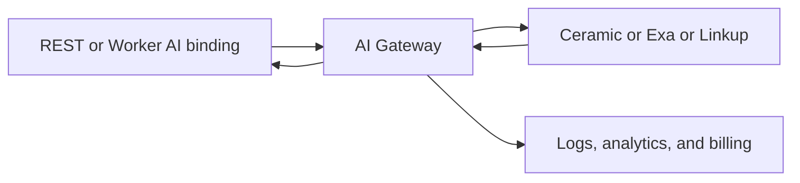

# Cloudflare Web Search API

[Web Search API](https://developers.cloudflare.com/web-search/) is an open beta, announced on 2 October 2026. An agent sends a query and gets structured results (URL, title, and a description when the provider returns one) to put into a model's context. The call goes through [AI Gateway](https://developers.cloudflare.com/ai-gateway/). Docs: [about](https://developers.cloudflare.com/web-search/about/), [how to use](https://developers.cloudflare.com/web-search/how-to-use/), [providers](https://developers.cloudflare.com/web-search/providers/). Changelog: [Introducing Web Search API](https://developers.cloudflare.com/changelog/post/2026-10-02-introducing-web-search-api/).

Every account already has a gateway named `default`. Search requests show up in that gateway's logs and analytics next to model calls.



## Request

REST is `POST https://api.cloudflare.com/client/v4/accounts/{account_id}/ai/websearch/`. The API token needs both **Account > Workers AI > Read** and **Account > AI Gateway > Read**.

A Worker uses the [AI binding](https://developers.cloudflare.com/workers-ai/configuration/bindings/) (`ai.binding = "AI"`) and calls `env.AI.websearch()`. Set `compatibility_date` to the current date. `websearch()` returns a `Response`; read it with `response.json()`.

| Field | REST | Worker binding | Constraint |
| --- | --- | --- | --- |
| Query | `query` | `query` | Required string, 1 to 1,024 characters |
| Provider | `provider` | `provider` | `ceramic` (default), `exa`, or `linkup` |
| Limit | `limit` | `limit` | Integer, default 10, minimum 1, maximum 10 |
| Gateway | `options.gateway.id` | `gatewayId` | Required. `default` exists on every account |
| Own key | `byokAlias` | `byokAlias` | Optional. `^[A-Za-z0-9_-]{1,64}$` |

```bash
curl "https://api.cloudflare.com/client/v4/accounts/$CLOUDFLARE_ACCOUNT_ID/ai/websearch/" \
  --request POST \
  --header "Authorization: Bearer $CLOUDFLARE_API_TOKEN" \
  --header "Content-Type: application/json" \
  --data '{"query":"...","provider":"ceramic","limit":5,"options":{"gateway":{"id":"default"}}}'
```

```ts
const response = await env.AI.websearch({
  gatewayId: "default",
  query: "...",
  provider: "exa",
  limit: 5,
});
```

The how-to example returns `items[]` of `{ url, title, description }` plus `metadata` of `{ query, requestId, latencyMs }`. The about page treats `description`, `image`, `favicon`, and last-modified as optional on each item. Optional fields appear only when that provider returns them.

To use search as a model tool, declare a function (the docs name it `web_search`), run `websearch()` when the model calls it, and send `JSON.stringify` of the results back as a `tool` message. The docs example does this with Workers AI (`@cf/google/gemma-4-26b-a4b-it`) and the same gateway id on both `AI.run` and `websearch`. The model in that sample is an illustration, not a requirement of the search API.

## Providers

Unset `provider` means Ceramic.ai. All three return the same result shape, so a switch is one field. Credits pay each provider's list API price with no Cloudflare markup. With a stored key, the provider bills that account directly.

| Provider | `provider` | List price | Zero Data Retention | What the call uses |
| --- | --- | --- | --- | --- |
| [Ceramic.ai](https://ceramic.ai/) | `ceramic` | $0.25 / 1,000 | Yes | Own index of more than 40 billion pages. Descriptions can run to 8,000 characters. Default. |
| [Exa](https://exa.ai/) | `exa` | $7.00 / 1,000 | No | [Exa Search API](https://exa.ai/docs/reference/search), `auto` search type. Page highlights become the description. |
| [Linkup](https://www.linkup.so/) | `linkup` | $5.00 / 1,000 | Yes | [Linkup Search API](https://docs.linkup.so/pages/documentation/endpoints/search/overview), `fast` depth, raw results, no generated answer. |

The [changelog post](https://developers.cloudflare.com/changelog/post/2026-10-02-introducing-web-search-api/) says all three support Zero Data Retention for requests made through Cloudflare. The [providers page](https://developers.cloudflare.com/web-search/providers/), also dated 2 October 2026, marks Exa as Zero Data Retention **No** and Ceramic and Linkup as **Yes**. Use the providers table for the per-provider flag.

Ceramic is the low-cost path for many searches per task. Exa is the expensive path when the description should be a short, query-relevant excerpt. Linkup is the middle price when the caller wants cited snippets and no synthesized answer.

## Billing And Keys

Load [AI Gateway credits](https://developers.cloudflare.com/ai-gateway/features/unified-billing/) or store a provider key on the gateway (**AI Gateway → gateway → Provider Keys**). If the provider is missing from the list, add it under **Configure custom providers**. Stored keys are encrypted with [Secrets Store](https://developers.cloudflare.com/secrets-store/). The request body never carries the provider key.

- `byokAlias` set: AI Gateway uses that alias. A missing provider or alias returns `400` and does not fall back to credits.
- `byokAlias` omitted: a stored key whose alias is `default` for that provider is used. Otherwise the search is billed to AI Gateway credits.

## Crawler Rules

Each provider has committed to Cloudflare [verified bots](https://developers.cloudflare.com/bots/concepts/bot/verified-bots/): the crawler identifies itself and respects `robots.txt`. Every result includes a link to the crawled page.

> **See also:** [Cloudflare cf CLI](/Technology/Cloud And DevOps/Tools/Cloudflare Cf CLI) · [Agent Infrastructure And Platforms](/Technology/AI/Tools/Agents/Agent Infrastructure And Platforms)
