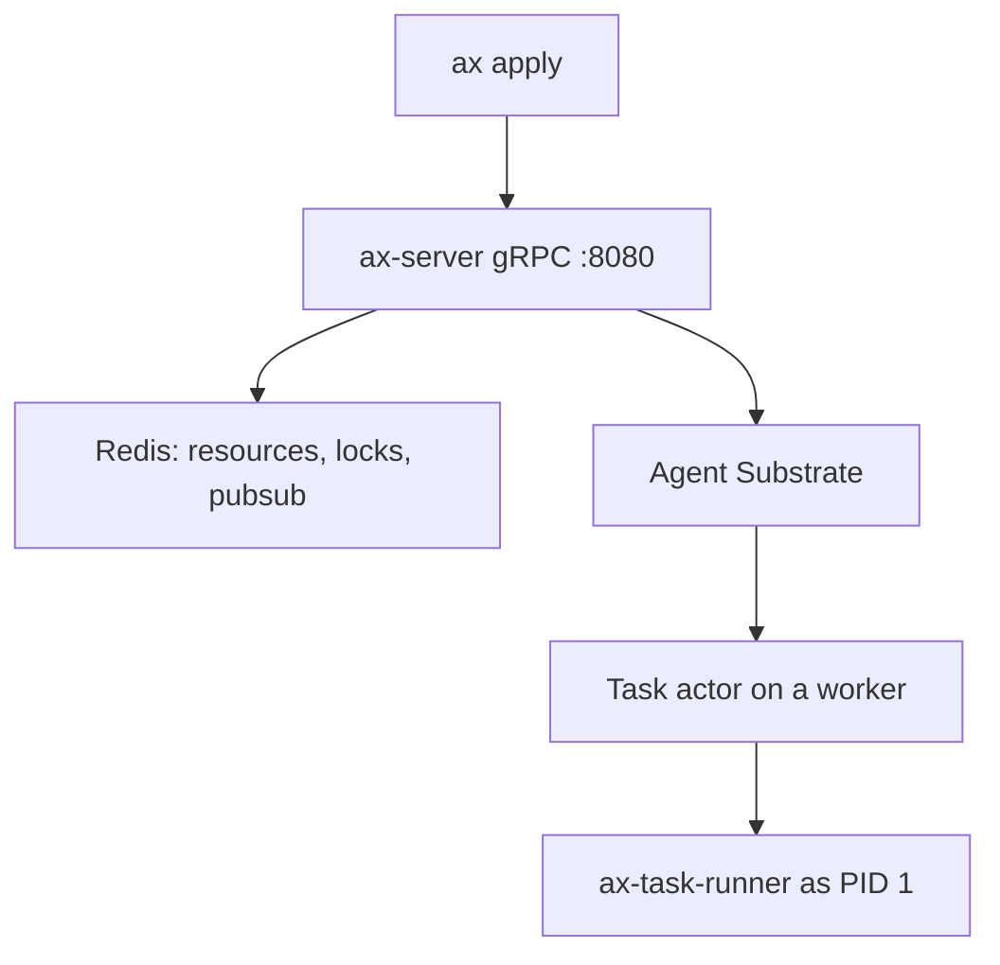

# Google AX

[AX](https://github.com/google/ax) ([agentexecutor.io](https://agentexecutor.io)) is Google's open control plane for running agent workloads as isolated, suspendable actors. You declare a task in YAML. AX sandboxes it on [Agent Substrate](https://github.com/agent-substrate/substrate), materializes its workspace, and lets you watch or shell into it. Apache-2.0, written in Go. The repo was created on 2026-03-30. As of 2026-10-04 the default branch had last been pushed on 2026-09-27, with about 13k stars and 649 forks.

This is not the [accessibility tree](/Technology/AI/Tools/Agents/AXTree%20Accessibility%20Tree.md). The name collision is only the letters AX.

The README warns that AX is in heavy development and will likely break its concepts, protocols, and specs before a stable release. The API group is `ax.io/v1alpha1`.

## What you declare

Every resource lives in an **atespace**. The default atespace is `default`. `metadata.name` and `metadata.atespace` must be lowercase RFC 1123 labels (at most 63 characters). `ax apply` rejects anything else, because Substrate would otherwise fail later with `ActorCreationFailed`.

Task
: The unit of isolated execution. `spec` sets the container image, command, env, CPU and memory requests and limits, and one or more workspace bindings. The first binding is the command's working directory. A task is cheap to create, suspend, and delete. AX does not model the agent's plan. One task can be the whole job, or one node in a tree of tasks the agent spawns. `CreateTask` in `ax.proto` says a task is immutable once created.

Workspace
: Declared once and bound by many tasks. The runner materializes it inside each sandbox before the command starts: Git clones, inline files, MCP registries and servers, and skill registries written to a path. A binding may also carry a `goal`, a plain-language description of a ready environment. On first boot the default runner hands that goal to an Antigravity agent. The agent needs `GEMINI_API_KEY` in the container and gets 10 minutes unless `AX_BOOTSTRAP_TIMEOUT` (a Go duration) says otherwise. The task stays not-ready until every workspace, including that agent run, has finished. Setup is recorded with a marker under `/ax` and is not repeated on resume, because re-cloning would wipe the restored workspace.

Model
: Provider, model id, a free-form `parameters` struct, and a `secretKey` reference to a Kubernetes secret. The manifest docs show `provider: google` with `gemini-3.8-flash` and `provider: anthropic` with `claude-opus-5`. AX's own components read `Model` resources too, including when a workspace is planned from a goal.

The product site lists a fourth primitive, **Gateway**, for host and port allowlists and for injecting credentials on incoming requests. `docs/concepts.md` and `pkg/apis/v1alpha1/ax.proto` on `main`, read on 2026-10-04, define only Task, Workspace, and Model. The [roadmap](https://github.com/google/ax/blob/main/docs/roadmap.md) still lists `Sandbox` / `SandboxConfig`, approval policies, token and timeout budgets, and governance as work to stabilize. Treat Gateway as a site claim, not as a kind you can apply from the published schema.

## Lifecycle

`status.phase` is a short label such as `Running`, `Suspended`, `Failed`, or `Terminating`. Conditions carry the detail. `ax watch` and `ax describe` are how you read them.

| Condition | True when |
| --- | --- |
| `WorkspaceReady` | Every bound workspace has finished setup. Stays true afterwards. |
| `Ready` | The task is running and `WorkspaceReady` is true. This is the condition to wait on. |

Suspending sets `Ready` to false with reason `TaskSuspended`. Resuming sets it back. `ax delete` tears the sandbox down on Substrate and blocks until the record is gone.

The status schema also has `pendingApproval` and `usage` token counters. The roadmap still lists approval policies and token budgets under core-spec stabilization, so those fields are not evidence that a budget or an approval gate already works.

## How it runs

AX stores state in Redis and reconciles directly with Agent Substrate under distributed locks. The design note says millions of short-lived tasks would push etcd past its comfort zone, which is why task records are not Kubernetes CRDs. The README and the product site say the system is built for billions of tasks per cluster and for sub-second resume of idle actors. Those are design targets. The docs read here do not include a benchmark.



| Binary | Role |
| --- | --- |
| `ax` | kubectl-shaped CLI. Applies manifests, watches status, tunnels to the cluster. |
| `ax-server` | gRPC API on port 8080, plus `GET /healthz`. Validates manifests, holds locks, reconciles with Substrate, writes Redis. The client parses YAML. The server receives typed RPCs, not raw YAML. |
| `ax-task-runner` | PID 1 in every task container. Bootstraps the workspace, serves metadata, supervises `spec.command`. Custom images can embed the `runner` package instead. |

Deploy lands in the `ax-system` namespace. Substrate must already be running in `ate-system`, with its Control API at `api.ate-system.svc.cluster.local:443`.

```bash
# CLI
go install github.com/google/ax/cmd/ax@latest

# Control plane. Needs Go, kubectl, ko, and a registry the cluster can pull.
make deploy AX_IMAGE_REPO=<your-registry>

ax apply -f examples/task.yaml
ax get tasks
ax watch task task123
ax ssh task123 -- ls -la /workspace   # requires spec.debug: true
ax suspend task task123
ax resume task task123
```

`ax` follows the active Kubernetes context, including switches made with `kubectx`. Override with `--context`. Scope with `-a` / `--atespace` (default `default`) and `-n` / `--namespace` (default `ax-system`). `--server` or `$AX_SERVER` skips control-plane auto-detection.

## Inside the sandbox

The control plane does not run `spec.command` as the container entrypoint. It always starts `/usr/local/bin/ax-task-runner` and passes the launch config in the environment.

| What AX sets | Value |
| --- | --- |
| Image | `spec.image`, or the default `ax-task-runner` image when unset |
| Command | `/usr/local/bin/ax-task-runner` |
| `AX_TASK_YAML` | Task launch YAML, excluding status |
| `AX_WORKSPACES_YAML` | Bound workspaces, multi-document, in binding order |
| `GEMINI_API_KEY` | Set when the atespace has a Gemini credential |
| Volume | Durable directory at `/workspace` |
| Readiness | `GET /readyz` on port 80 |

On boot the runner loads the specs, serves metadata on port 80, prepares each workspace once, then starts `spec.command` as a child in its own process group. The child gets `AX_METADATA_URL` (for example `http://127.0.0.1:80`) and `spec.env`. The runner stays up after the command exits, so the metadata server and `ax ssh` still work. It logs the exit code. The control plane does not currently read that exit code back. On stop or suspend it sends the command's process group `SIGTERM`, waits ten seconds, then kills what remains.

`/workspace` is what survives suspend and resume. Substrate snapshots the volume and restores it into a fresh container, so the files come back and the process tree does not.

With `spec.debug: true`, the same port also serves Agent Substrate guest services over gRPC (`h2c`): a process service (`ax ssh`) and a filesystem service. They are off by default because they allow arbitrary process execution and file access. `ax ssh` refuses a task that has not opted in.

| Endpoint | Returns |
| --- | --- |
| `GET /healthz` | `200` once the runner is alive |
| `GET /readyz` | `503` while workspaces initialize, then `200` |
| `GET /metadata/v1alpha1/ax/task` | Task launch YAML, no status |
| `GET /metadata/v1alpha1/ax/workspaces` | Bound workspaces, multi-document YAML |

The default image is Python 3.12 with `git`, `curl`, `openssh-client`, and the Antigravity agent, because goal-based bootstrap calls Antigravity. The runner doc pins an example base at `gcr.io/ax-substrate/ate-images/ax-task-runner@sha256:69b764607ec7f1e433d83d2eca17dccfa04f663b43f071fd376e2dd716a57f8c`. A custom image must still provide `/usr/local/bin/ax-task-runner`. AX creates a Substrate actor template per distinct image and environment. Three levels of replacement: extend the default image, embed `github.com/google/ax/runner` and call `runner.Run`, or implement the HTTP and workspace contract in another language.

## Reaching a task

A task has no Kubernetes Service of its own. Traffic goes through Substrate's **atenet** router (`atenet-router` in `ate-system`). The router reads the header `ate-target-actor`, whose value is `<atespace>/<task>` (AX names the actor after the task), resumes the actor if it was suspended, and proxies to the worker. `Host` is left for the application.

```bash
curl -H "ate-target-actor: default/task123" \
  http://atenet-router.ate-system.svc.cluster.local/metadata/v1alpha1/ax/task
```

From a laptop, port-forward `svc/atenet-router` in `ate-system` and send the same header. gRPC clients pass it as outgoing metadata. That is what `ax ssh` does.

## Still on the roadmap

The roadmap, not the current schema, calls for: stable phases, limits, budgets, and approval policies; a separate actor for first-time workspace setup with a tighter privilege split; idle detection that suspends on its own; forking a task including its checkpoint and filesystem; goal-driven discovery of toolchains, MCP servers, and skills; swapping out the built-in Antigravity bootstrap; SPIFFE identities; and OpenTelemetry plus agent trajectories collected at the runner.

## Where it sits

AX is the cluster orchestrator. [google/agents-cli](https://github.com/google/agents-cli) is the helper for creating and deploying agents on Google Cloud around the Agent Development Kit. [Zeron](/Technology/AI/Tools/Agents/Zeron.md) drives existing coding-agent CLIs on a device. [Pi Durable](/Technology/AI/Tools/Agents/Pi%20Durable.md) is an in-process harness for crash-survivable conversations. AX assumes Substrate is already installed and then adds the agent manifests, the workspace bootstrap, and the kubectl-like CLI.

> **See also:** [Agent Infrastructure And Platforms](/Technology/AI/Tools/Agents/Agent%20Infrastructure%20And%20Platforms.md) · [AXTree Accessibility Tree](/Technology/AI/Tools/Agents/AXTree%20Accessibility%20Tree.md) · [Zeron](/Technology/AI/Tools/Agents/Zeron.md) · [Pi Durable](/Technology/AI/Tools/Agents/Pi%20Durable.md)
